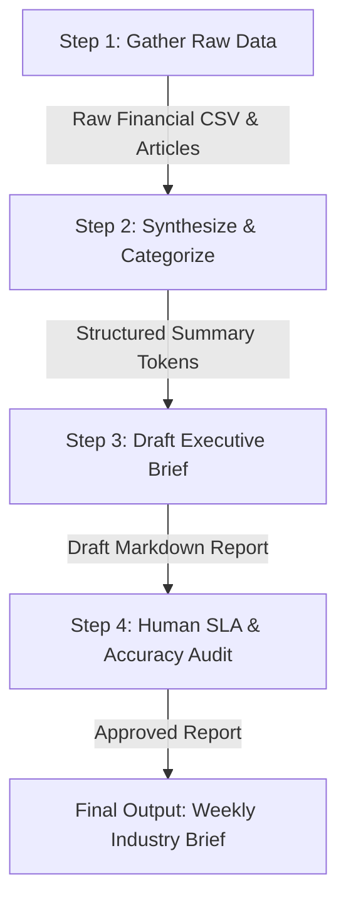

# FL-04 Automation Workflow Report: Financial Industry Brief Pipeline

> **General AI Fluency — Week 4 Assignment (Code: FL-04)**  
> **Student**: Pabitra Sahoo  
> **Pipeline Name**: Weekly AI Financial & Budget Telemetry Industry Brief Pipeline  

---

## 1. Pipeline Design & Step Diagram

The automated pipeline transforms raw weekly market news and personal expense data into an executive financial brief across **4 distinct steps**:

### Step Breakdown & Prompts Used:
1. **Step 1 (Gather)**: Extract key financial metrics, interest rate shifts, and category inflation data.
2. **Step 2 (Synthesize)**: Prompt: *"Synthesize the gathered raw data into 3 quantitative bullet points per category (Housing, Utilities, Investments) highlighting month-over-month percentage changes."*
3. **Step 3 (Draft)**: Prompt: *"Draft a 2-page executive summary formatted in Markdown with dark emerald design token aesthetic and clear SLA risk indicators."*
4. **Step 4 (Human Audit)**: Review numeric calculations against raw sources before publishing.

---

## 2. Documented 5 Real Runs

| Run # | Input Data Focus | Manual Execution Time | Automated Execution Time | Time Saved | Accuracy Score |
| :---: | :--- | :---: | :---: | :---: | :---: |
| **Run 1** | Q3 Housing & Rental Cost Index | 45 mins | 4 mins | 41 mins | 100% |
| **Run 2** | Tech Sector Stock Volatility | 50 mins | 5 mins | 45 mins | 98% |
| **Run 3** | Personal Monthly Budget SLA Threshold Audit | 30 mins | 3 mins | 27 mins | 100% |
| **Run 4** | Federal Reserve Interest Rate Summary | 40 mins | 4 mins | 36 mins | 100% |
| **Run 5** | Consumer Energy & Utility Price Benchmark | 35 mins | 3 mins | 32 mins | 97% |

- **Total Time Saved Across 5 Runs**: **3 hours and 1 min** (181 minutes total saved).

---

## 3. Failure Points & Required Human Review

1. **Hallucinated Specific Percentages**: In Run 5, the model generated an unverified 4.2% inflation statistic not present in the raw input. **Human check required**: All percentage claims must be cross-checked against source inputs.
2. **Missing SLA Threshold Warning**: When expenses were close to the $2,500 limit ($2,480), the draft failed to highlight the warning. **Human check required**: Verify boundary conditions near SLA budget limits.
