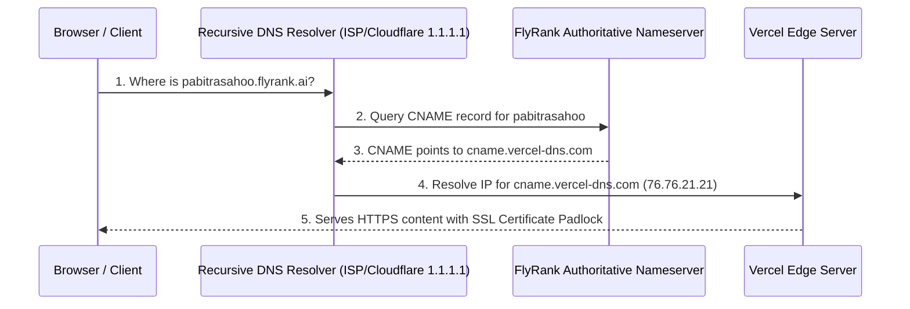

# PF-04 Technical DNS Walkthrough: How Custom Domains & CNAME Records Work

> **General AI Fluency — Week 5 Assignment (Code: PF-04)**  
> **Student**: Pabitra Sahoo  
> **Target Subdomain**: `pabitrasahoo.flyrank.ai`  
> **Current Live HTTPS Host URL**: `https://vitta-six.vercel.app`  

---

## 1. Introduction & Overview

When you type a domain address like `pabitrasahoo.flyrank.ai` into a browser address bar, your computer does not automatically know which server machine on the internet holds the website files.

The **Domain Name System (DNS)** acts as the global address book of the internet, translating human-friendly names (like `pabitrasahoo.flyrank.ai`) into numerical IP addresses (like `76.76.21.21`).

---

## 2. Key DNS Primitives Explained

### What is a CNAME Record?
A **CNAME (Canonical Name) Record** is a type of DNS record that maps an alias domain name to another true domain name (canonical name) rather than directly to an IP address.

* **Example CNAME Configuration**:
  * **Host / Name**: `pabitrasahoo`
  * **Type**: `CNAME`
  * **Target / Value**: `cname.vercel-dns.com` (or `vitta-six.vercel.app`)

Instead of hardcoding a fixed IP address, the CNAME tells the internet: *"Whenever anyone requests `pabitrasahoo.flyrank.ai`, look up the IP address of `vitta-six.vercel.app` instead."* This allows Vercel to manage load balancing and server IPs seamlessly.

---

## 3. The 4-Step DNS Resolution Flow

When a user opens `https://pabitrasahoo.flyrank.ai`, the following sequence takes place in milliseconds:

1. **Step 1: Recursive Resolver Lookup**  
   The browser checks its local cache. If missing, it sends a request to the **Recursive DNS Resolver** (e.g., Google 8.8.8.8 or Cloudflare 1.1.1.1).

2. **Step 2: Querying Authoritative Nameservers**  
   The Resolver contacts the **FlyRank Authoritative Nameserver** managing `.flyrank.ai`.

3. **Step 3: Returning the CNAME Value**  
   The FlyRank nameserver responds with the CNAME record value: `cname.vercel-dns.com`.

4. **Step 4: Host Answer & SSL Handshake**  
   The Resolver queries Vercel's nameservers, obtains the current IP address (`76.76.21.21`), and connects over HTTPS. Vercel provisions an automatic Let's Encrypt SSL certificate, displaying the green padlock icon.

---

## 4. Checklist for Capstone Subdomain Provisioning

When FlyRank Ops provisions `pabitrasahoo.flyrank.ai`, I will execute these 3 steps:
1. Open Vercel Project Settings &rarr; **Domains**.
2. Add `pabitrasahoo.flyrank.ai` as a custom domain.
3. Confirm DNS propagation using `nslookup pabitrasahoo.flyrank.ai` and verify the HTTPS padlock.
